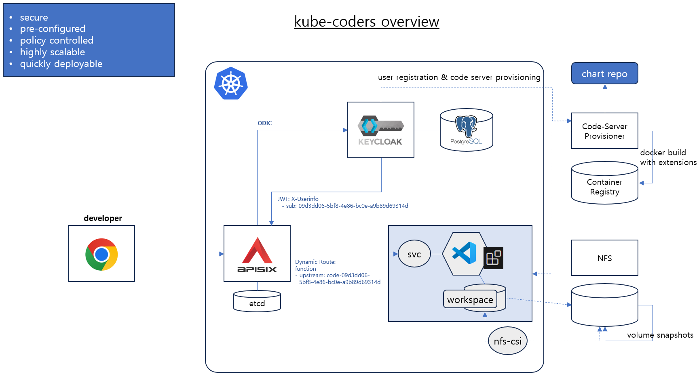

# kube-coders


---

멀티 개발자가 VS Code 기반으로 원격 개발이 가능한 환경을 제공합니다.
- Code-Server를 기준으로 kubernetes 클러스터 내 개별 파드를 구성하여 제공합니다.
- Keycloak 통합 인증 서버를 통해 사용자 인증을 수행합니다. (OIDC)
- API Gateway에서 사용자 인증 처리 후 Keycloak 사용자 ID (sub)를 이용하여 각 사용자 별 Code-Server로 연결합니다.
- Code-Server는 API Gateway에 등록된 사설인증서를 이용한 TLS 통신으로 동작합니다. (Extension 정상 구동 시 필요)
- Code-Server 버전과 VS-Code 버전에 따라 지원되는 extension을 컨테이너 이미지 빌드시 포함하여 구성합니다.
- 각 사용자별 코드 서버 배포는 Keycloak 사용자 등록 --> 사용자 별 개발 환경 배포 (Helm chart) 형태로 수행되고, 자동화 구성이 필요합니다. (TBD)
---
  
---
  
---

### 구성 순서
---
1. apisix-gateway 설치
2. apisix-dashboard 설치
3. keycloak 설치
4. keycloak realm, user 설정
5. nfs, nfs-csi storage class 설치
6. code-server 배포
7. apisix route 설정
---

```
---
uri: /*
name: 'code-server-route'
plugins:
  openid-connect:
    bearer_only: false
    client_id: apisix
    client_secret: ldrUpII6f5XEds+ljNMP/oQRJjNmUo9wrLRZLnDsdbOMVhzeYwkDzrNrUmN8GR5j
    discovery: http://keycloak/realms/dev/.well-known/openid-configuration
    introspection_endpoint_auth_method: client_secret_post
    realm: dev
    scope: openid profile
    set_userinfo_header: true
    ssl_verify: false
    token_endpoint_auth_method: client_secret_basic
  proxy-rewrite:
    regex_uri:
      - ^/(.*)
      - /$1
  serverless-post-function:
    functions:
      - |
        function log(conf, ctx)
          local core = require "apisix.core"
          local b64 = require("ngx.base64")
          local cjson = require "cjson"
          local upstream = require("apisix.upstream")
          local ipmatcher  = require("resty.ipmatcher")
          local jwt_userinfo = core.request.header(ctx, "X-Userinfo")
          decoded_userinfo, err = b64.decode_base64url(jwt_userinfo)
          local userinfo = cjson.decode(decoded_userinfo)
          ngx.log(ngx.ERR, "UserId: " .. userinfo.sub)
          local host_name = "code-" .. userinfo.sub
          local function parse_domain(host)
            local ip = ""
            if not ipmatcher.parse_ipv4(host) and not ipmatcher.parse_ipv6(host)
            then
              local ip, err = core.resolver.parse_domain(host)
              if ip then
                return ip
              end
              if err then
                core.log.error("dns resolver domain: ", host, " error: ", err)
              end
            end
            return host
          end
          local up_conf = {
                            timeout = {
                            connect = 6,
                            send = 300,
                            read = 300
                            },
                            scheme = "http",
                            type = "roundrobin",
                            pass_host = "pass",
                            keepalive_pool = {
                              idle_timeout = 60,
                              requests = 1000,
                              size = 320
                            },
                            hash_on = "vars",
                            nodes = {
                              {
                                priority = 0,
                                port = 8443,
                                host = parse_domain(host_name),
                                weight = 1
                              }
                            }
                          }
          local matched_route = ctx.matched_route
          up_conf.parent = matched_route
          local upstream_key = up_conf.type .. "#route_" .. matched_route.value.id
          core.log.info("upstream_key: ", upstream_key)
          upstream.set(ctx, upstream_key, ctx.conf_version, up_conf)  
        end
        return log
    phase: access
upstream:
  nodes:
    - host: httpbin.org
      port: 80
      weight: 1
  type: roundrobin
  scheme: http
  pass_host: pass
enable_websocket: true
```
