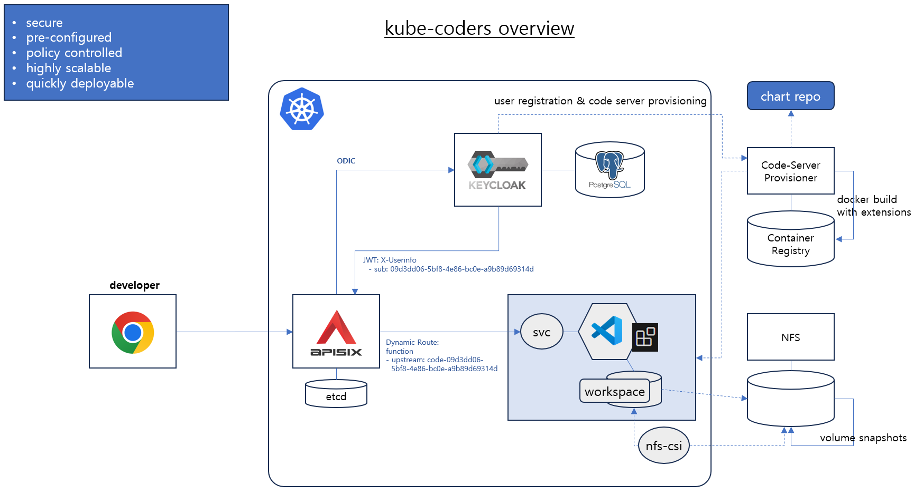
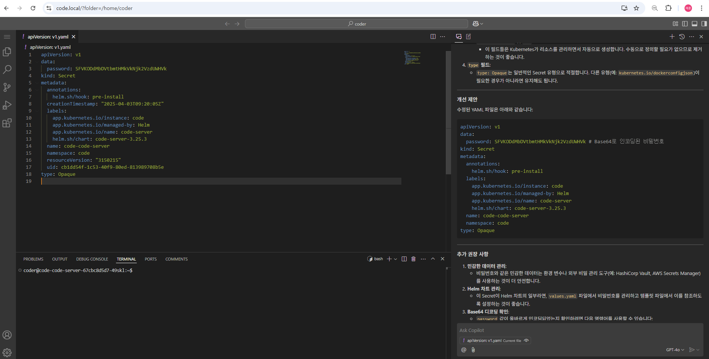
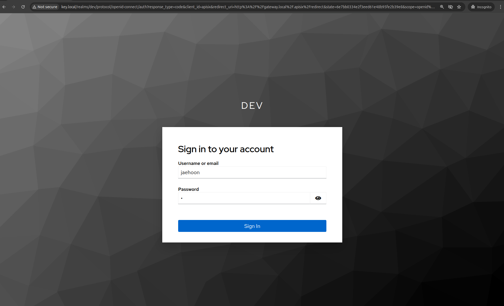
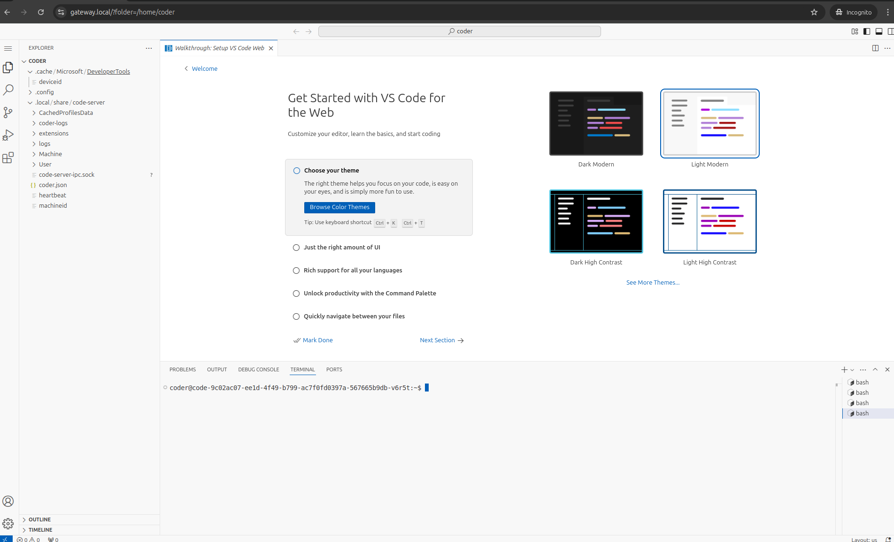
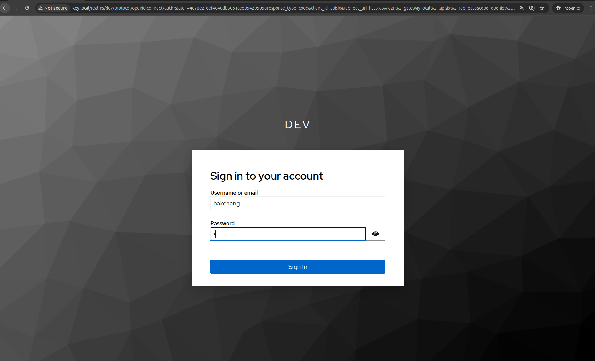
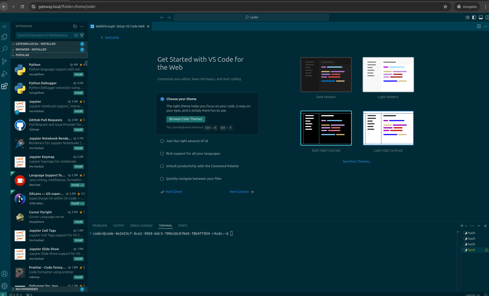
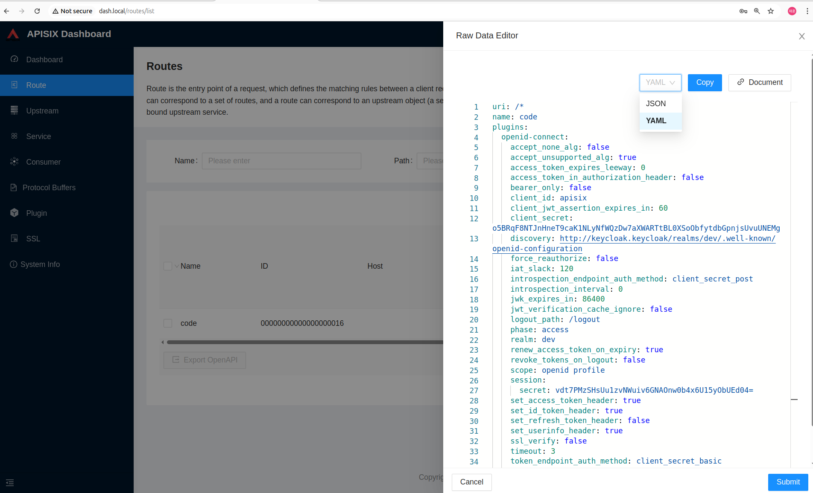

# kube-coders


---

멀티 개발자가 VS Code 기반으로 원격 개발이 가능한 환경을 제공합니다.
- Code-Server를 기준으로 kubernetes 클러스터 내 개별 파드를 구성하여 제공합니다.
- Keycloak 통합 인증 서버를 통해 사용자 인증을 수행합니다. (OIDC)
- API Gateway에서 사용자 인증 처리 후 Keycloak 사용자 ID (sub)를 이용하여 각 사용자 별 Code-Server로 연결합니다.
- Code-Server는 API Gateway에 등록된 사설인증서를 이용한 TLS 통신으로 동작합니다. (Extension 정상 구동 시 필요)
- Code-Server 버전과 VS-Code 버전에 따라 지원되는 extension을 컨테이너 이미지 빌드시 포함하여 구성합니다.
- 각 사용자별 코드 서버 배포는 Keycloak 사용자 등록 --> 사용자 별 개발 환경 배포 (Helm chart) 형태로 수행되고, 자동화 구성이 필요합니다. (TBD)
---
  
---
  
---

### 구성 순서
---

**1. nfs, nfs-csi storage class 설치**
```
# nfs 서버 설치
apt install nfs-server
dnf install nfs-utils

mkdir -p /var/nfs/pv
chown -R 65534:65534 /var/nfs/pv

# 파일 공유 설정
cat <<EOF > /etc/exports
/var/nfs/pv 192.168.122.126(rw,sync,no_subtree_check,no_root_squash)  # node 1
/var/nfs/pv 192.168.122.210(rw,sync,no_subtree_check,no_root_squash)  # node 2
EOF

systemctl restart nfs-server
exportfs -v

# nfs-csi 드라이버 설치
curl -skSL https://raw.githubusercontent.com/kubernetes-csi/csi-driver-nfs/v4.5.0/deploy/install-driver.sh | bash -s v4.5.0 --

# strageclass 설치
$ cat <<EOF > nfs-sc.yml
apiVersion: storage.k8s.io/v1
kind: StorageClass
metadata:
  name: nfs-csi
provisioner: nfs.csi.k8s.io
parameters:
  server: 192.168.122.126 # NFS 서버 주소
  share: /var/nfs/pv      # 공유 폴더 이름
  mountPermissions: "0777"
reclaimPolicy: Retain
volumeBindingMode: Immediate
mountOptions:
  - nfsvers=4.1
EOF

# 스토리지 클래스 생성
kubectl apply -f nfs-sc.yml

# 기본 스토리지 클래스 설정
kubectl patch storageclass nfs-csi -p '{"metadata": {"annotations":{"storageclass.kubernetes.io/is-default-class":"true"}}}'

# pvc 생성 테스트
kubectl create -f https://raw.githubusercontent.com/kubernetes-csi/csi-driver-nfs/master/deploy/example/pvc-nfs-csi-dynamic.yaml

# snapshot controller CRD 설치
kubectl apply -f https://raw.githubusercontent.com/kubernetes-csi/external-snapshotter/v6.0.1/client/config/crd/snapshot.storage.k8s.io_volumesnapshotclasses.yaml
kubectl apply -f https://raw.githubusercontent.com/kubernetes-csi/external-snapshotter/v6.0.1/client/config/crd/snapshot.storage.k8s.io_volumesnapshotcontents.yaml
kubectl apply -f https://raw.githubusercontent.com/kubernetes-csi/external-snapshotter/v6.0.1/client/config/crd/snapshot.storage.k8s.io_volumesnapshots.yaml

# external snapshot controller 설치
kubectl apply -f https://raw.githubusercontent.com/kubernetes-csi/external-snapshotter/v6.0.1/deploy/kubernetes/snapshot-controller/rbac-snapshot-controller.yaml
kubectl apply -f https://raw.githubusercontent.com/kubernetes-csi/external-snapshotter/v6.0.1/deploy/kubernetes/snapshot-controller/setup-snapshot-controller.yaml

# snapshotclass 설치
kubectl apply -f https://raw.githubusercontent.com/kubernetes-csi/csi-driver-nfs/master/deploy/example/snapshot/snapshotclass-nfs.yaml

# volumesnapshot 생성
kubectl apply -f https://raw.githubusercontent.com/kubernetes-csi/csi-driver-nfs/master/deploy/example/snapshot/snapshot-nfs-dynamic.yaml

# pvc 생성 from volumesnapshot
kubectl apply -f https://raw.githubusercontent.com/kubernetes-csi/csi-driver-nfs/master/deploy/example/snapshot/pvc-nfs-snapshot-restored.yaml
kubectl apply -f https://raw.githubusercontent.com/kubernetes-csi/csi-driver-nfs/master/deploy/example/snapshot/nginx-pod-restored-snapshot.yaml

```

**2. apisix-gateway 설치**
```
# helm chart를 이용한 apisix 설치

# apisix ingress와 tls 설정을 추가한 values.yaml을 적용

# self signed 인증서 생성 (Wildcard Top Level Domain 인식안됨 *.local -> *.kw.local)
# openssl req -x509 -newkey rsa:4096 -sha256 -days 3650 -nodes -keyout local.key -out local.crt -subj '/CN=*.kw.local' -addext 'subjectAltName=DNS:*.kw.local'

# gateway.local (API서버 ingress 용 사설인증서 생성)
openssl req -x509 -newkey rsa:4096 -sha256 -days 3650 -nodes -keyout gateway.key -out gateway.crt -subj '/CN=gateway.local' -addext 'subjectAltName=DNS:gateway.local'

# 인증서 시크릿 생성
kubectl create secret tls gateway-tls --key gateway.key --cert gateway.crt -n apisix

# apisix 설치
helm upgrade -i apisix apisix-2.10.0.tgz -f values.yaml -n apisix --create-namespace

# 기본 ingress 삭제 후, dashboard, admin API 용 ingress 생성
kubectl delete ingress apisix -n apisix
kubectl apply -f ingress.yml -n apisix

# host 파일에 ingress controller IP 설정
# 192.168.100.1 gateway.local dash.local admin.local key.local
```

**3. keycloak 설치**

```
# Keycloak 설치 - Postgres 기본 설정으로 설치
helm upgrade -i keycloak keycloak-24.5.0.tgz -f values.yaml -n keycloak --create-namespace
```

**4. keycloak realm, user 설정**

```
# 변수 설정
KEYCLOAK_URL="http://key.local"
ADMIN_USERNAME="admin"
ADMIN_PASSWORD="admin"
REALM_NAME="dev"
CLIENT_ID="apisix"

# ADMIN_TOKEN 조회
ADMIN_TOKEN=$(curl -s -X POST "${KEYCLOAK_URL}/realms/master/protocol/openid-connect/token" \
         -H "Content-Type: application/x-www-form-urlencoded" \
         -d "username=${ADMIN_USERNAME}" \
         -d "password=${ADMIN_PASSWORD}" \
         -d "grant_type=password" \
         -d "client_id=admin-cli" | jq -r '.access_token')

# ADMIN_TOKEN TTL 변경 -> 1 시간
curl -s -X PUT "${KEYCLOAK_URL}/admin/realms/master" \
     -H "Authorization: Bearer ${ADMIN_TOKEN}" \
     -H "Content-Type: application/json" \
     -d '{
         "accessTokenLifespan": 3600
     }'

# dev realm 생성		 
curl -s -X POST "${KEYCLOAK_URL}/admin/realms" \
     -H "Authorization: Bearer ${ADMIN_TOKEN}" \
     -H "Content-Type: application/json" \
     -d '{"realm":"'${REALM_NAME}'", "enabled":true}'		 
		 
# apisix client 생성		 
curl -s -X POST "${KEYCLOAK_URL}/admin/realms/${REALM_NAME}/clients" \
     -H "Authorization: Bearer ${ADMIN_TOKEN}" \
     -H "Content-Type: application/json" \
     -d '{
         "clientId": "'${CLIENT_ID}'",
         "protocol": "openid-connect",
         "publicClient": false,
         "standardFlowEnabled": true,
         "directAccessGrantsEnabled": true,
         "webOrigins": ["+"]
     }'

# client uuid 조회	 
CLIENT_UUID=$(curl "${KEYCLOAK_URL}/admin/realms/${REALM_NAME}/clients" -H "Authorization: Bearer ${ADMIN_TOKEN}" |  jq -r --arg CLIENT_ID "$CLIENT_ID" '.[] | select(.clientId == $CLIENT_ID) | .id')

# client secret 조회
CLIENT_SECRET=$(curl -s -X GET "${KEYCLOAK_URL}/admin/realms/${REALM_NAME}/clients/${CLIENT_UUID}/client-secret" \
     -H "Authorization: Bearer ${ADMIN_TOKEN}" | jq -r '.value')

# 사용자 생성
curl -s -X POST "${KEYCLOAK_URL}/admin/realms/${REALM_NAME}/users" \
     -H "Authorization: Bearer ${ADMIN_TOKEN}" \
     -H "Content-Type: application/json" \
     -d '{
           "username": "jaehoon",
           "email": "jaehoon@kubeworks.net",
           "enabled": true,
           "firstName": "Jaehoon",
           "lastName": "Jung",
           "credentials": [{"type": "password", "value": "1", "temporary": false}]
       }'

# 사용자 ID 조회	   
USER_ID=$(curl -s -X GET "${KEYCLOAK_URL}/admin/realms/${REALM_NAME}/users?username=jaehoon" \
     -H "Authorization: Bearer ${ADMIN_TOKEN}" \
     | jq -r '.[0].id')
```

**5. code-server 배포**

```
# Service 이름을 code-$USER_ID 로 설정하여 코드서버을 Deployment로 생성하여 배포
# Code 서버의 최신 버전 이미지를 플러그인 포함하여 빌드
# Keycloak USER_ID 생성 후 자동으로 배포하도록 구성

# charts/code-server 디렉토리에서
# vi values.yaml , USER_ID 값으로 셋팅

fullnameOverride: "code-9c02ac07-ee1d-4f49-b799-ac7f0fd0397a"

# release 명을 code-$USER_ID 값으로 설정하여 설치
helm upgrade -i code-f079498e-c932-41bd-87e2-41717e5c8fb7 -n code-server -f backend-values.yaml code

# 신규 사용자 ID 생성 후 추가로 배포
helm upgrade -i code-a80214d6-5deb-4b5e-9ddb-0cdcbaee91ec -n code-server -f frontend-values.yaml code

# Keycloak 설정, Code-server 배포를 자동화하는 Job 구성 (TBD)

# 현재 Code 서버는 linuxserver/code-server:4.96.4 이미지를 기반으로 JDK21, gradle-8.8-bin, copilot/copilot-chat 플러그인이 설치된 이미지로 구성
# 필요시 kubectl, helm, k9s 등 k8s 툴킷 설치 가능 (API access role 설정 필요)

FROM lscr.io/linuxserver/code-server:4.96.4

RUN  echo "deb [arch=amd64] https://some.repository.url focal main" | sudo tee /etc/apt/sources.list.d/adoptium.list > /dev/null
RUN apt update && apt-get install -y wget apt-transport-https gpg unzip
RUN wget -qO - https://packages.adoptium.net/artifactory/api/gpg/key/public | gpg --dearmor | tee /etc/apt/trusted.gpg.d/adoptium.gpg > /dev/null
RUN echo "deb https://packages.adoptium.net/artifactory/deb $(awk -F= '/^VERSION_CODENAME/{print$2}' /etc/os-release) main" | tee /etc/apt/sources.list.d/adoptium.list
RUN apt update && apt-get install -y temurin-21-jdk -y
RUN  apt-get clean && rm -rf /config/* /tmp/* /var/lib/apt/lists/* /var/tmp/*

COPY extensions /root/extensions
RUN  mv /root/extensions/starship /usr/local/bin
RUN  cp /root/extensions/.bashrc  /config
ENV  PATH=/app/code-server/bin:$PATH

RUN code-server --extensions-dir /config/extensions --install-extension /root/extensions/copilot-1.259.1336_vsixhub.com.vsix
RUN code-server --extensions-dir /config/extensions --install-extension /root/extensions/copilot-chat-0.23.2024120602_vsixhub.com.vsix
RUN code-server --extensions-dir /config/extensions --install-extension /root/extensions/mhutchie.git-graph-1.30.0.vsix
RUN code-server --extensions-dir /config/extensions --install-extension /root/extensions/humao.rest-client-0.26.0.vsix

RUN code-server --extensions-dir /config/extensions --install-extension vscjava.vscode-java-pack
RUN code-server --extensions-dir /config/extensions --install-extension vmware.vscode-boot-dev-pack

```
**5-1 사용자 A 로그인**
  

**5-2 사용자 A 용 코드서버로 화면 이동**


**5-3 사용자 B 로그인**
  

**5-4 사용자 B 용 코드서버로 화면 이동**


**6. apisix route 설정**

```
# CoreDNS에 클러스터 인그레스 엔트리 추가
hosts {
        192.168.100.1 gateway.local dash.local key.local
        fallthrough
}

# CoreDNS 재기동
k rollout restart deploy coredns -n kube-system


# Curl을 이용하여 code-server 용 라우트 생성
# API 서버에 code-server용 route를 초기 생성한 후 keycloak 인증 후 upstream 주소를 변경하는 function을 추가
curl  -XPOST admin.local/apisix/admin/routes -H "X-Api-Key: edd1c9f034335f136f87ad84b625c8f1" -d '{
    "uri":"/*",
    "plugins":{
        "openid-connect":{
            "client_id":"apisix",
            "client_secret":"15DchbvG38ltq8RwxU3l0090KTppMAtW",
            "discovery":"http://keycloak.keycloak/realms/dev/.well-known/openid-configuration",
            "scope":"openid profile",
            "bearer_only":false,
            "realm":"dev",
            "introspection_endpoint_auth_method":"client_secret_post"
        }
    },
    "upstream":{
      "type":"roundrobin",
      "nodes":{
            "httpbin.org:80":1
      }
    },
    "enable_websocket": true
}'

# APISIX Dashboard에서 Route 편집
# serverless-function과 upstream 내용 추가 반영 후 submit 하여 적용
http://dash.local/routes/list > More > View
---
uri: /*
name: code
plugins:
  openid-connect:
    accept_none_alg: false
    accept_unsupported_alg: true
    access_token_expires_leeway: 0
    access_token_in_authorization_header: false
    bearer_only: false
    client_id: apisix
    client_jwt_assertion_expires_in: 60
    client_secret: o5BRqF8NTJnHneT9caK1NLyNfWQzDw7aXWARTtBL0XSoObfytdbGpnjsUvuUNEMg
    discovery: http://keycloak.keycloak/realms/dev/.well-known/openid-configuration
    force_reauthorize: false
    iat_slack: 120
    introspection_endpoint_auth_method: client_secret_post
    introspection_interval: 0
    jwk_expires_in: 86400
    jwt_verification_cache_ignore: false
    logout_path: /logout
    phase: access
    realm: dev
    renew_access_token_on_expiry: true
    revoke_tokens_on_logout: false
    scope: openid profile
    session:
      secret: vdt7PMzSHsUu1zvNWuiv6GNAOnw0b4x6U15yObUEd04=
    set_access_token_header: true
    set_id_token_header: true
    set_refresh_token_header: false
    set_userinfo_header: true
    ssl_verify: false
    timeout: 3
    token_endpoint_auth_method: client_secret_basic
    unauth_action: auth
    use_nonce: false
    use_pkce: false
  serverless-post-function:
    functions:
      - |
        function log(conf, ctx)
          local core = require "apisix.core"
          local b64 = require("ngx.base64")
          local cjson = require "cjson"
          local upstream = require("apisix.upstream")
          local ipmatcher  = require("resty.ipmatcher")

          local user = core.request.header(ctx, "X-Userinfo")
          decoded_user, err = b64.decode_base64url(user)
          ngx.log(ngx.ERR, "X-Userinfo: " .. decoded_user)
          local user_obj = cjson.decode(decoded_user)
          ngx.log(ngx.ERR, "UserId: " .. user_obj.sub)
          local host_name = "code-" .. user_obj.sub .. ".code-server"

          local function parse_domain(host)
            local ip = ""
            if not ipmatcher.parse_ipv4(host) and not ipmatcher.parse_ipv6(host)
            then
              local ip, err = core.resolver.parse_domain(host)
              if ip then
                return ip
              end

              if err then
                core.log.error("dns resolver domain: ", host, " error: ", err)
              end
            end
            return host
          end

          local up_conf = {
                            timeout = {
                            connect = 6,
                            send = 300,
                            read = 300
                            },
                            scheme = "http",
                            type = "roundrobin",
                            pass_host = "pass",
                            keepalive_pool = {
                              idle_timeout = 60,
                              requests = 1000,
                              size = 320
                            },
                            hash_on = "vars",
                            nodes = {
                              {
                                priority = 0,
                                port = 8080,
                                host = parse_domain(host_name),
                                weight = 1
                              }
                            }
                          }

          local matched_route = ctx.matched_route
          up_conf.parent = matched_route
          local upstream_key = up_conf.type .. "#route_" .. matched_route.value.id
          core.log.info("upstream_key: ", upstream_key)

          upstream.set(ctx, upstream_key, ctx.conf_version, up_conf)  

        end
        return log
    phase: access
upstream:
  nodes:
    - host: httpbin.org
      port: 80
      weight: 1
  type: roundrobin
  hash_on: vars
  scheme: http
  pass_host: pass
enable_websocket: true
status: 1

---
# favicon 호출 에러 방지를 위한 dummy route 추가
# browser에서 code-server 연동 시 favicon 호출로 인한 500 에러 발생으로 해당 오류 제거를 위한 별도 route 추가
uri: /favicon.ico
name: favicon.ico
upstream:
  nodes:
    - host: httpbin.org
      port: 80
      weight: 1
  timeout:
    connect: 6
    send: 6
    read: 6
  type: roundrobin
  scheme: http
  pass_host: pass
  keepalive_pool:
    idle_timeout: 60
    requests: 1000
    size: 320
status: 1

```
  
